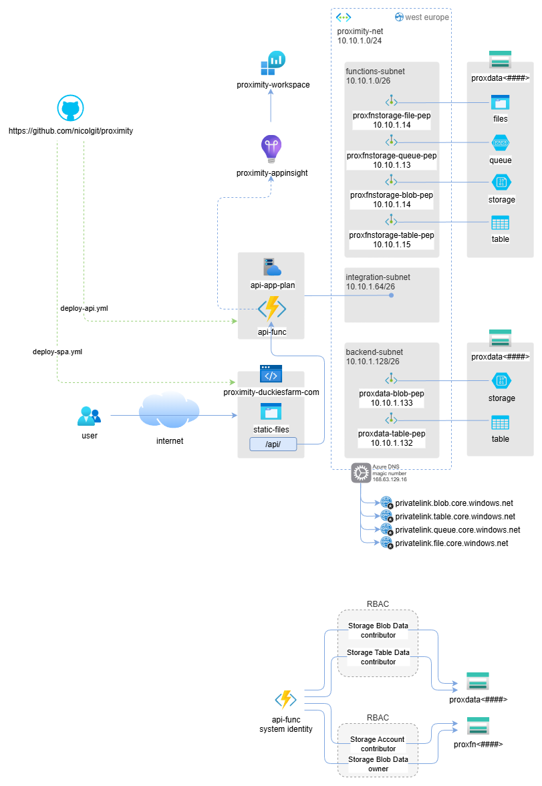

# Deployment Guide

This document provides comprehensive instructions for deploying the Proximity application infrastructure to Azure. Upon successful deployment, the architecture will match the following diagram:



## Architecture Overview

The Proximity solution consists of:
- **Azure Functions** (Flex Consumption plan) - Backend API with secure storage integration
- **Azure Static Web Apps** - Frontend SPA hosting with integrated CI/CD
- **Azure Storage Accounts** - Secure data storage with private endpoints
- **Virtual Network** - Private networking with subnet isolation
- **Application Insights** - Monitoring and telemetry
- **Private DNS Zones** - Name resolution for private endpoints

## Prerequisites

Before starting the deployment, ensure you have:

1. **Azure CLI** installed and logged in
   ```powershell
   az login
   ```

2. **Required permissions** in your Azure subscription:
   - Owner or Contributor role on the target resource group
   - Ability to create service principals and role assignments

3. **Resource providers registered**:
   ```powershell
   az provider register --namespace Microsoft.App
   az provider register --namespace Microsoft.Web
   az provider register --namespace Microsoft.Storage
   az provider register --namespace Microsoft.Insights
   ```

4. **GitHub repository** forked and ready for CI/CD setup

## Step 1: Infrastructure Deployment

Deploy the Azure infrastructure using the provided Bicep template:

```powershell
# Create resource group (if not exists)
az group create --name rg-proximity --location "West Europe"

# Deploy infrastructure
az deployment group create \
    --resource-group rg-proximity \
    --template-file main.bicep \
    --parameters location="West Europe"
```

**Expected deployment time:** 10-15 minutes

The deployment will create all necessary Azure resources with secure defaults:
- Private networking configuration
- Managed identity authentication
- Private endpoints for storage accounts
- Application monitoring setup

## Step 2: Post-Deployment Configuration

After the Bicep deployment completes successfully, configure the CI/CD pipelines:

### 2.1 Download Publishing Profiles

1. **Azure Functions Publishing Profile**:
   - Go to **Azure Portal** → **Resource Groups** → **rg-proximity**
   - Navigate to the Function App (name: `api-backend-xxxxxx`)
   - Go to **Deployment** → **Deployment Center**
   - Click **Manage publish profile** → **Download publish profile**
   - Save this file as you'll need it for GitHub secrets

2. **Static Web Apps API Token**:
   - Go to **Azure Portal** → **Resource Groups** → **rg-proximity** 
   - Navigate to the Static Web App (name: `proximity-spa-xxxxxx`)
   - Go to **Settings** → **Configuration**
   - Copy the **Deployment token** value

### 2.2 Configure GitHub Secrets

Navigate to your GitHub repository and set up the following secrets:

**Repository Path**: GitHub → **Your Organization** → **proximity** → **Settings** → **Secrets and variables** → **Actions** → **Repository secrets**

Add these secrets:

| Secret Name | Value | Description |
|-------------|--------|-------------|
| `AZURE_FUNCTIONAPP_PUBLISH_PROFILE` | Contents of downloaded publish profile | Function App deployment credentials |
| `AZURE_STATIC_WEB_APPS_API_TOKEN` | Deployment token from Static Web App | SPA deployment token |

### 2.3 Update Workflow Configuration

Update the GitHub workflow files to match your deployed resource names:

1. **API Deployment** (`.github/workflows/deploy-api.yml`):
   ```yaml
   env:
     AZURE_FUNCTIONAPP_NAME: "api-backend-xxxxxx" # Replace with your actual Function App name
   ```

2. **SPA Deployment** (`.github/workflows/deploy-spa.yml`):
   - No changes needed - uses the API token for deployment

## Step 3: Trigger Deployments

### 3.1 Deploy the API

The API deployment workflow is triggered by changes to the workflow file. To trigger the first deployment:

```powershell
# Make a small change to trigger deployment
git add .github/workflows/deploy-api.yml
git commit -m "Configure API deployment"
git push origin develop
```

### 3.2 Deploy the SPA

Similarly, trigger the SPA deployment:

```powershell
# Make a small change to trigger deployment
git add .github/workflows/deploy-spa.yml
git commit -m "Configure SPA deployment"
git push origin develop
```

## Step 4: Verification

### 4.1 Verify API Deployment

1. Check the Function App in Azure Portal
2. Navigate to **Functions** and verify your functions are listed
3. Test a sample endpoint:
   ```bash
   curl https://api-backend-xxxxxx.azurewebsites.net/api/area
   ```

### 4.2 Verify SPA Deployment

1. Navigate to your Static Web App URL (found in Azure Portal)
2. Verify the application loads correctly
3. Test API integration functionality

### 4.3 Verify Monitoring

1. Go to **Application Insights** in Azure Portal
2. Check **Live Metrics** for real-time telemetry
3. Verify logs are being collected under **Logs** section

## Security Configuration

The deployment includes several security best practices:

- **Managed Identity**: Function App uses system-assigned managed identity for Azure services authentication
- **Private Endpoints**: Storage accounts are accessible only through private endpoints
- **VNet Integration**: Function App is integrated with a virtual network for secure communication
- **HTTPS Only**: All services are configured for HTTPS-only traffic
- **Minimal Permissions**: Role assignments follow the principle of least privilege

## Troubleshooting

### Common Issues

1. **Deployment Fails with "Resource Provider Not Registered"**:
   ```powershell
   az provider register --namespace Microsoft.App
   ```

2. **Function App Deployment Fails**:
   - Verify the publish profile is correctly copied to GitHub secrets
   - Check that the Function App name in the workflow matches the deployed resource

3. **Static Web App Not Updating**:
   - Verify the API token is correctly set in GitHub secrets
   - Check the workflow logs for any build errors

### Monitoring and Logs

- **Application Insights**: Monitor application performance and errors
- **Function App Logs**: Available in Azure Portal → Function App → Monitor → Logs
- **GitHub Actions**: Check workflow execution logs in GitHub repository

### Support Resources

- [Azure Functions Documentation](https://docs.microsoft.com/en-us/azure/azure-functions/)
- [Azure Static Web Apps Documentation](https://docs.microsoft.com/en-us/azure/static-web-apps/)
- [Azure Bicep Documentation](https://docs.microsoft.com/en-us/azure/azure-resource-manager/bicep/)

## Next Steps

After successful deployment:

1. **Configure Custom Domain** (Optional): Set up custom domains for both Function App and Static Web App
2. **Set Up Monitoring Alerts**: Configure alerts in Application Insights for proactive monitoring
3. **Environment Promotion**: Create additional environments (staging, production) using the same Bicep templates
4. **Security Review**: Conduct a security review and implement additional security measures as needed

## Clean Up

To remove all deployed resources:

```powershell
az group delete --name rg-proximity --yes --no-wait
```

**Warning**: This action is irreversible and will delete all resources in the resource group.

