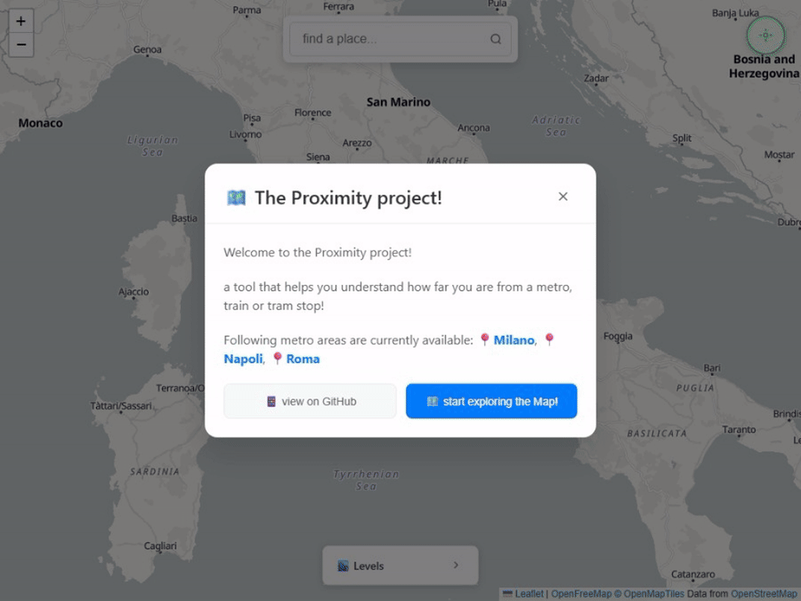

# 📡 The Proximity Project 📡

**The Proximity Project** is a browser-based single-page application (SPA) that visualizes a map with isochrones—areas reachable within a certain distance or time—from the nearest railway or tram station. Currently focused on selected metropolitan areas in Italy, the project aims to help users understand how well-connected a location is via reliable rail-based public transport.

## 🌍 Why This Project?

In many parts of Italy—and often elsewhere—rail-based public transport (trains and trams) is significantly more reliable and punctual than road-based alternatives. This is largely due to the absence of traffic-related delays.

**The Proximity Project** is useful for:

- **Tourists** looking for short-term rentals in well-connected areas, even if they are not central.
- **Professionals** relocating for work who want to minimize car usage.
- **Families** seeking to reduce the number of cars needed by choosing a location with good public transport access.

## Features

- 🔍 **Address search**: Quickly find any location by typing an address.
- 📍 **Current location detection**: Automatically centers the map on your current position.
- 🗺️ **Global isochrone visualization**: Displays isochrones for the entire covered area, using color gradients to indicate distance from the nearest station—ideal for a quick visual overview.
- 🚉 **Station and stop display**: View all railway and tram stations/stops in the selected area.
- 🎯 **Station-specific isochrones**: Select a specific station or stop to view its individual isochrone.
- 🪧 **Interactive isochrones**: Click on any isochrone (global or station-specific) to see a popup showing the distance (in time) from the selected or nearest station.

## 🌐 Access the Application 🌐

You can explore **The Proximity Project** directly at:

👉 [https://proximity.duckiesfarm.com](https://proximity.duckiesfarm.com) 

access specific metropolitan areas directly using the following URLs:

- 🏢 [Rome](https://proximity.duckiesfarm/italy/rome)
- 🏢 [Milan](https://proximity.duckiesfarm/italy/milan)
- 🏢 [Naples](https://proximity.duckiesfarm/italy/naples)
- 🏢 [Turin](https://proximity.duckiesfarm/italy/turin)
- 🏢 [Bologna](https://proximity.duckiesfarm/italy/bologna)
- 🏢 [Florence](https://proximity.duckiesfarm/italy/florence)

## 🛠️ Technologies Used

- **JavaScript / TypeScript** – Core languages for the frontend logic  
- **Vue.js** – Framework for building the single-page application  
- **Leaflet** – Lightweight open-source library for interactive maps  
- **C# / Azure Functions** – Backend services and serverless APIs  
- **OpenStreetMap / Mapbox** – Map rendering and geospatial data sources  

# ☕ Support the Project
If you find The Proximity Project useful or believe in its mission to promote sustainable and accessible urban mobility, consider supporting its development.
Maintaining and improving this project takes time, effort, and resources. Your contribution helps cover infrastructure costs, data sourcing, and future enhancements.

👉 [Buy me a coffee](https://buymeacoffee.com/nicolcoffee) – every little bit helps!

# 📄 License

This project is licensed under the [MIT License](LICENSE).

